    

    <b>Automatic Architecture Diagrams from Code</b> 
    <a href="https://github.com/swark-io/swark">GitHub</a> • <a href="https://swark.io">Website</a> • <a href="mailto:contact@swark.io">Contact Us</a>

## Usage Instructions

1. **Render the Diagram**: Use the links below to open it in Mermaid Live Editor, or install the [Mermaid Support](https://marketplace.visualstudio.com/items?itemName=bierner.markdown-mermaid) extension.
2. **Recommended Model**: If available for you, use `claude-3.5-sonnet` [language model](vscode://settings/swark.languageModel). It can process more files and generates better diagrams.
3. **Iterate for Best Results**: Language models are non-deterministic. Generate the diagram multiple times and choose the best result.

## Generated Content
**Model**: GPT-4o - [Change Model](vscode://settings/swark.languageModel)  
**Mermaid Live Editor**: [View](https://mermaid.live/view#pako:eNp1lclyozAQQH9FpXMyH-DDVMnG-xov2YQPBGRbNVi4hMiMK5V_H6yWQDLk0qp-jeEhq5svHGcJwx0ciqOMLie0DUKBUF58QLph8pPJG0KI0P6_i2R5bugePT7-Rl26yeI_TP0aL_e365hIQuHdY5czmcMtevSWoHVWKJbvgQXAeplQMkvT8r7A-8Bvz-IxM3AAcF5Kpwb1tEagY1_HQbvHSmZJESujMqQm921GFW4IjauS7zSpuKs11CojHcc6Ttq1ljKp9mdKdeYrzQxsCM1NwddZGOrKTLXATMe5jot2mReen1KeK_jZktrcN1rVvCH1VNd8r3VdcNWWWmel45OO63a1Nfvk7K_ZqA2F1PfaWtqw2tmK7_RssWu00RZbHXc6Prcb9SLFjpnkzEi9UEOuvtZrzRtib3XNV3uvC67cixZ61fFNx_d2ua6MRGLECKE69bVI19CGFOmZiq9EAoNdIUK0BenCAt1Igh-kIiGqw076FPI7rYHFTa-hLd2JjSz3zGAakAEs0JBk1G625bchZs3GFPI7s4nFTbOpLd2ZzSz3zGAgkAks0J1k1m62yBQ_8DhSPBPWb05dikYsvdQqC7_oPRian_zQ_TvFU66q80yWFMgVDQoRawF_xsOHADrFTnmHuRPXwfXEc6A7eRzsdL1D_c5zCvWpd2F96hzq_OMObey2-4r19uAHfGbyHPGk_HZ-hVid2JmFuINCnLBDVKQqxN_lRcUlKVUDHpUbfMYdJQv2gKNCZZuriG0us-J4wp1DlObs-z8wfXAy) | [Edit](https://mermaid.live/edit#pako:eNp1lclyozAQQH9FpXMyH-DDVMnG-xov2YQPBGRbNVi4hMiMK5V_H6yWQDLk0qp-jeEhq5svHGcJwx0ciqOMLie0DUKBUF58QLph8pPJG0KI0P6_i2R5bugePT7-Rl26yeI_TP0aL_e365hIQuHdY5czmcMtevSWoHVWKJbvgQXAeplQMkvT8r7A-8Bvz-IxM3AAcF5Kpwb1tEagY1_HQbvHSmZJESujMqQm921GFW4IjauS7zSpuKs11CojHcc6Ttq1ljKp9mdKdeYrzQxsCM1NwddZGOrKTLXATMe5jot2mReen1KeK_jZktrcN1rVvCH1VNd8r3VdcNWWWmel45OO63a1Nfvk7K_ZqA2F1PfaWtqw2tmK7_RssWu00RZbHXc6Prcb9SLFjpnkzEi9UEOuvtZrzRtib3XNV3uvC67cixZ61fFNx_d2ua6MRGLECKE69bVI19CGFOmZiq9EAoNdIUK0BenCAt1Igh-kIiGqw076FPI7rYHFTa-hLd2JjSz3zGAakAEs0JBk1G625bchZs3GFPI7s4nFTbOpLd2ZzSz3zGAgkAks0J1k1m62yBQ_8DhSPBPWb05dikYsvdQqC7_oPRian_zQ_TvFU66q80yWFMgVDQoRawF_xsOHADrFTnmHuRPXwfXEc6A7eRzsdL1D_c5zCvWpd2F96hzq_OMObey2-4r19uAHfGbyHPGk_HZ-hVid2JmFuINCnLBDVKQqxN_lRcUlKVUDHpUbfMYdJQv2gKNCZZuriG0us-J4wp1DlObs-z8wfXAy)

```mermaid
graph TD
  subgraph Server
    A[Express Server] --> B[Socket.IO]
  end

  subgraph Users
    C[User Routes]
    D[User Controller]
    E[User Service]
    F[User Model]
    C --> D --> E --> F
  end

  subgraph Products
    G[Product Routes]
    H[Product Controller]
    I[Product Service]
    J[Product Model]
    G --> H --> I --> J
  end

  subgraph Orders
    K[Order Routes]
    L[Order Controller]
    M[Order Service]
    N[Order Model]
    K --> L --> M --> N
  end

  subgraph Wishlist
    O[Wishlist Routes]
    P[Wishlist Controller]
    Q[Wishlist Service]
    R[Wishlist Model]
    O --> P --> Q --> R
  end

  subgraph Reviews
    S[Review Routes]
    T[Review Controller]
    U[Review Service]
    V[Review Model]
    S --> T --> U --> V
  end

  subgraph Categories
    W[Category Routes]
    X[Category Controller]
    Y[Category Service]
    Z[Category Model]
    W --> X --> Y --> Z
  end

  subgraph Brands
    AA[Brand Routes]
    AB[Brand Controller]
    AC[Brand Service]
    AD[Brand Model]
    AA --> AB --> AC --> AD
  end

  subgraph Banners
    AE[Banner Routes]
    AF[Banner Controller]
    AG[Banner Service]
    AH[Banner Model]
    AE --> AF --> AG --> AH
  end

  subgraph Tickets
    AI[Ticket Routes]
    AJ[Ticket Controller]
    AK[Ticket Service]
    AL[Ticket Model]
    AI --> AJ --> AK --> AL
  end

  subgraph Notifications
    AM[Notification Helper]
    AN[Notification Model]
    AM --> AN
  end

  subgraph Utilities
    AO[Utility Functions]
  end

  Server --> Users
  Server --> Products
  Server --> Orders
  Server --> Wishlist
  Server --> Reviews
  Server --> Categories
  Server --> Brands
  Server --> Banners
  Server --> Tickets
  Server --> Notifications
  Server --> Utilities
```

